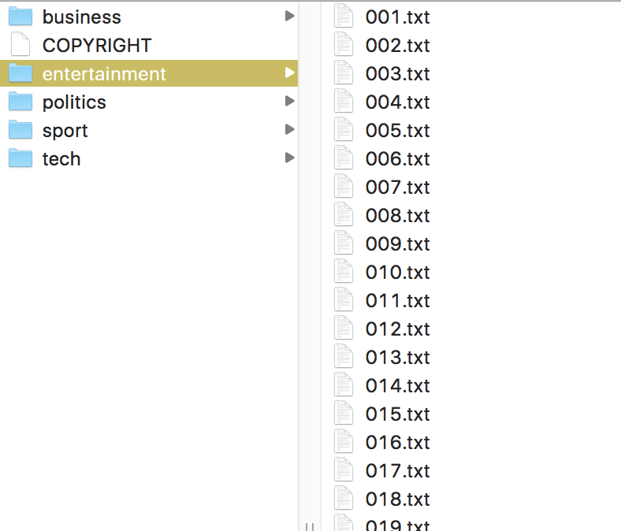

# Recommending Articles


The goal of this project is to make a simple article recommendation engine using [word2vec](http://arxiv.org/pdf/1301.3781.pdf). The project uses a "database" from [Stanford's GloVe project](https://nlp.stanford.edu/projects/glove/) trained on a dump of Wikipedia. The project involves reading in a database of word vectors and a corpus of text articles then organizing them into a handy table (list of lists) for processing.

Around the recommendation engine, I will build a web server that displays a list of [BBC](http://mlg.ucd.ie/datasets/bbc.html) articles for URL `http://localhost:5000` (testing) or whatever the IP address is of my Amazon server (deployment):


Clicking on one of those articles takes you to an article page that shows the text of the article as well as a list of five recommended articles:


## Article word-vector centroids

In a nutshell, each word has a vector of, say, 300 floating-point numbers that somehow capture the meaning of the word, at least as it relates to other words within a corpus. These vectors are derived from a neural network that learns to map a word to an output vector such that neighboring words in some large corpus are close in 300-space. ("The main intuition underlying the model is the simple observation that ratios of word-word co-occurrence probabilities have the potential for encoding some form of meaning." see [GloVe project](https://nlp.stanford.edu/projects/glove/).)

Two words are related if their word vectors are close in 300 space. Similarly, if we compute the centroid of a document's cloud of word vectors, related articles should have centroids close in 300 space. Words that appear frequently in a document push the centroid in the direction of that word's vector. The centroid is just the sum of the vectors divided by the number of words in the article. Given an article, we can compute the distance from its centroid to every other article's centroid. The article centroids closest to the article of interest's centroid are the most similar articles. Surprisingly, this simple technique works well as you can see from the examples above.

Given a word vector filename, such as `glove.6B.300d.txt`, and the root directory of the BBC article corpus, we will use the following functions from `doc2vec.py` in the main `server.py` file to load them into memory. Finding the glove and articles arguments is trickier than usual because we are launching the Web server using gunicorn. For example:

```
gunicorn -D --threads 4 -b 0.0.0.0:5000 --access-logfile server.log --timeout 60 server:app glove.6B.300d.txt bbc
```

To find `glove.6B.300d.txt` and `bbc`, we look at just after the `server:app` argument:

```python
# get commandline arguments
i = sys.argv.index('server:app') # find out where arguments start
glove_filename = sys.argv[i+1]
articles_dirname = sys.argv[i+2]

gloves = load_glove(glove_filename)
articles = load_articles(articles_dirname, gloves)
```

The `gloves` variable is the dictionary mapping a word to its 300-vector vector. The `articles` is a list of records, one for each article. An article record is just a list containing the fully-qualified file name, the article title, the text without the title, and the word vector computed from the text without the title.

Then to get the list of most relevant five articles, we'll do this:

```python
similar_articles = recommended(doc, articles, 5)
```

The details of all those functions is in `doc2vec.py`.

A walkthrough of how this recommendation engine works is in `walkthrough.ipynb`.


## Web server

Besides those core functions, I build a web server using flask with [gunicorn](http://gunicorn.org/). The server will respond to two different URLs: the list of articles is at `/` and each article is at something like `/article/business/353.txt`. The BBC corpus in directory `bbc` is organized with topic subdirectories and then a list of articles as text files:




The `server.py` file contains functions of flask "routes" for the necessary URLs.

```Python
@app.route("/")
def articles():
    """Show a list of article titles"""
    ...
    
@app.route("/article/<topic>/<filename>")
def article(topic,filename):
    """
    Show an article with relative path filename.
    Assumes the BBC structure of topic/filename.txt
    so our URLs follow that.
    """
    ...
```    

I am also using the template engine [jinja2](http://jinja.pocoo.org/docs/2.9/) that is built-in with flask. When call `render_template()` from within a flask route method, it looks in the `templates` subdirectory for the file indicated in that function call. 


## Launching server at Amazon
Launch a Linux instance big enough to hold the 300-vectors at Amazon and install my software + necessary data. Then launch the server. The steps are as follows:

Log in to remote machine:
 
```bash
$ ssh -i "hxu.pem" ubuntu@somemachineIPorname
```

After logging in, import basic packages on the remote machine:

```bash
pip install --upgrade pip
pip install numpy Flask
conda update -n base conda
conda install gunicorn 
```

Then clone my repository into the home directory:

```bash
cd ~
git clone https://github.com/hxu47/article-recommendation
cd article-recommendation
```

Now, download the data I need and unzip:

```bash
wget https://s3-us-west-1.amazonaws.com/msan692/glove.6B.300d.txt.zip
wget https://s3-us-west-1.amazonaws.com/msan692/bbc.zip
unzip glove.6B.300d.txt.zip
unzip bbc.zip
```

Finally, run my server:

```bash
$ gunicorn -D --threads 4 -b 0.0.0.0:5000 --access-logfile server.log --timeout 60 server:app glove.6B.300d.txt bbc
```

The `-D` means put the server in daemon mode, which runs in the background. 

`IP.txt` file stores the **public** IP address of the server with `:5000` on the line by itself, such as `54.198.43.135:5000`.


## Reference:
[Standalone WSGI Containers](http://flask.pocoo.org/docs/1.0/deploying/wsgi-standalone/)
[Efficient Estimation of Word Representations in Vector Space](http://arxiv.org/pdf/1301.3781.pdf)
[Word similarity and relationships](https://github.com/parrt/msds501/blob/master/projects/wordsim.md)
[GloVe: Global Vectors for Word Representation](https://nlp.stanford.edu/projects/glove/)